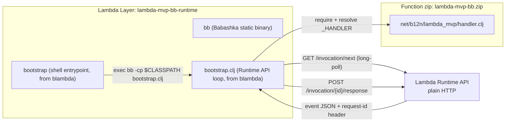

# lambda-mvp-bb: AWS Lambda custom runtime in Babashka (via blambda)

Run [Babashka](https://babashka.org) on AWS Lambda as a **custom
runtime**, via [blambda](https://github.com/jmglov/blambda) (which
wraps [bb-lambda](https://github.com/tatut/bb-lambda)'s Runtime API
loop). Unlike this family's other custom-runtime siblings, nothing here
is compiled ahead of time: the handler namespace is `require`d and
interpreted at cold start by Babashka's own SCI interpreter, and
Babashka's own static binary is what actually starts inside the Lambda
execution environment.

This is a deliberately small extraction: a demo handler (greet + echo +
warm-invocation counter) and a `bb bench` tool for comparing cold vs.
warm boot time across memory tiers, reproducible against **your own AWS
account**. No function URL, no bearer auth, no public HTTP endpoint:
everything here is `aws lambda invoke`.

## Status

This is an early release, the fifth sibling in the `lambda-mvp-*`
family. Task names, defaults, and even the shape of `bb bench`'s output
may change without a deprecation period. Pin a commit or tag if you
depend on the current behavior staying exactly as it is.

## How it works



blambda's shipped `bootstrap` shell script hardcodes `LAYERS_DIR=/opt`
(where Lambda mounts layers, not where the function's own code lands),
so this is the only sibling whose runtime ships as a Lambda **Layer**
rather than folded into a single self-contained zip. See
`docs/guide/runtime-layer-build.md` for the full story.

- `src/net/b12n/lambda_mvp/handler.clj`: the demo handler: greeting +
  raw-event echo + warm-invocation counter. Swap in your own.
- blambda's `resources/bootstrap` + `resources/bootstrap.clj`: the
  Runtime API loop, used as-is, never forked.
- `tools/mock_runtime_api.py`: offline mock of the Runtime API, so the
  whole loop is testable without AWS.

See `docs/guide/architecture.md` for the whole-system view and
`docs/guide/runtime-layer-build.md` for the two-artifact build.

## Requirements

- [babashka](https://babashka.org) on PATH (`brew install
  borkdude/brew/babashka`). Every task below is `bb <task>` — babashka
  is both this project's task runner and its actual Lambda runtime
  language.
- AWS CLI v2.
- An AWS account and credentials the `aws` CLI can already use:
  `AWS_PROFILE`/`AWS_REGION` env vars, or `aws configure`. **Nothing in
  this repo hardcodes a profile, account, or region.** Every task below
  uses whatever your CLI already resolves.

No Docker, unlike the Jolt/jank-based siblings.

## Quickstart

```sh
bb probe          # offline e2e: mock Runtime API + blambda's real loop (no AWS, no Docker)
bb test           # run the unit tests (no AWS, no Docker)
bb demo           # build + deploy + invoke in one go, prerequisites checked first
bb build          # bb blambda build-runtime-layer + build-lambda -> two zips in target/
bb deploy         # idempotent: publish the runtime layer, create/update the IAM role + function
bb invoke         # single ad-hoc invoke, prints the response body + REPORT line
bb bench          # cold/warm boot-time comparison across memory tiers
bb teardown       # delete the function, role, and every published layer version
```

`bb build` targets `arm64` unless `LAMBDA_ARCH=x86_64` (or `amd64`) is
set — Babashka publishes static binaries for both. `bb deploy`'s IAM
role (`lambda-mvp-bb-role`) and function (`lambda-mvp-bb`) names are
overridable via `LAMBDA_MVP_FUNCTION_NAME`. `bb bench`'s memory tiers
and warm-sample count are overridable via `BENCH_MEMORY_TIERS` (default
`2048,3008`) and `BENCH_WARM_SAMPLES` (default `5`).

## Cold vs. warm boot time

See [`docs/guide/cold-warm-boot.md`](docs/guide/cold-warm-boot.md) for
what `bb bench` measures and how to read the table it prints, and
[`docs/guide/five-way-comparison.md`](docs/guide/five-way-comparison.md)
for how this project's numbers sit alongside the other four
`lambda-mvp-*` siblings' — once this project has a real bench run
against a live AWS account (this repo's own scaffolding session had
none configured).

## Extension points

Not built here, but straightforward follow-ups if you need them:

- A deps layer (`bb blambda build-deps-layer`) + `awyeah-api`, for an
  S3/DynamoDB-backed handler like blambda's own `site-analyser`
  example.
- Pods via `babashka.pods`, for a handler that needs a capability
  outside Babashka's built-in namespaces.
- A Function URL + bearer token, for an HTTP-reachable demo instead of
  `aws lambda invoke` only.

## References

- [blambda](https://github.com/jmglov/blambda) ·
  [bb-lambda](https://github.com/tatut/bb-lambda) (the project blambda
  wraps) · [Babashka](https://babashka.org)
- [lambda-mvp-cljs](https://github.com/b12n-oss/lambda-mvp-cljs) (the
  ClojureScript sibling) ·
  [lambda-mvp-jlt](https://github.com/b12n-oss/lambda-mvp-jlt) (the
  Jolt sibling) ·
  [lambda-mvp-jnk](https://github.com/b12n-oss/lambda-mvp-jnk) (the
  jank sibling) ·
  [lambda-mvp-rst](https://github.com/b12n-oss/lambda-mvp-rst) (the
  Jolt+Rust sibling)
- [AWS Lambda Runtime API / custom runtimes](https://docs.aws.amazon.com/lambda/latest/dg/runtimes-custom.html)

## License

EPL 2.0, see `LICENSE`.
