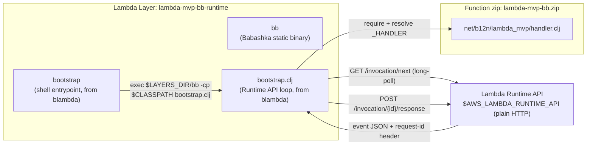

# Architecture

This page is the whole-system view: how blambda's Runtime API loop, the two-artifact build, and the two babashka-driven tools (AWS lifecycle, bench) fit together. Each piece has its own deep-dive page linked from here; this page is the map, not the territory.

## The whole flow

## blambda's Runtime API loop

`bootstrap` (a POSIX shell script) is what AWS Lambda actually execs as the container entrypoint. It resolves `$LAYERS_DIR` (`/opt` in production — where Lambda mounts layers), builds a classpath from the function's own code directory plus anything staged by a deps layer, then execs the Babashka static binary (`bb`) against `bootstrap.clj`, the actual Runtime API poll/execute/respond loop. `bootstrap.clj` resolves `_HANDLER` (`net.b12n.lambda-mvp.handler/handler`) into a namespace + function via `require`/`resolve`, then loops: `GET /invocation/next`, decode the JSON body into a keyword-keyed map, call the handler with that event plus the raw response-headers map as context, JSON-encode whatever the handler returns, `POST /invocation/{id}/response`.

Both `bootstrap` and `bootstrap.clj` ship as-is from blambda (`~/dev/b12n-oss/blambda/resources/`) — this project doesn't fork or patch either. See [Building the runtime layer](runtime-layer-build.md) for why that constrains the packaging shape.

## The build

`bb build` wraps two of blambda's own CLI subcommands: `build-runtime-layer` (downloads the Babashka static binary for the target arch, bundles it with `bootstrap`/`bootstrap.clj`) and `build-lambda` (zips this project's `src/net/b12n/lambda_mvp/handler.clj`, preserving its nested path). Neither compiles anything — Babashka interprets the handler namespace at cold start via SCI, the same interpreter that runs `bb` scripts generally.

See [Building the runtime layer](runtime-layer-build.md) for the full two-artifact story and the real measured artifact sizes.

## The AWS lifecycle tool

`script/aws_lifecycle.clj` is a small, generic (no hardcoded profile, account, or region) idempotent create-or-update-or-delete tool, driven entirely by whatever the caller's own `aws` CLI already has configured. `deploy!` publishes a new runtime-layer version, then creates the IAM role and Lambda function on first run (attaching that layer version) and updates them on every later run. `invoke!` runs a single ad-hoc invocation. `teardown!` deletes the function, every published layer version, and the role. `bb deploy`/`bb invoke`/`bb teardown` are thin wrappers around it.

`deploy!` reads `LAMBDA_ARCH` directly (default `arm64`) rather than detecting it from a compiled binary's ELF header the way the Jolt-based siblings' lifecycle scripts do — blambda's build takes architecture as an explicit input in the first place, so there's nothing to detect post-hoc.

## `bb demo`: the same flow, one command

`bb demo` (`script/demo.clj`) runs `build`, `deploy` and `invoke` in order, after checking `aws` is on PATH and that the AWS CLI has credentials and a region. Unlike the Jolt/jank-based siblings' `demo` tasks, there's no Docker or cross-platform-emulation check: blambda's build downloads a prebuilt static binary for the target arch directly, no container build involved.

## The bench tool

`script/bench.clj` holds the pure logic: `parse-report-line` turns a CloudWatch `REPORT` line into a Clojure map, and `format-table` renders a comparison across memory tiers as markdown. Neither function does any I/O, which is what makes them unit-testable via `bb test` with no AWS account involved. This file (and its test) is byte-identical to the copy on every other sibling.

`script/bench_run.clj` is the orchestration: for each memory tier, it changes the function's configured memory (which forces a fresh execution environment on the next invoke), measures one cold sample and several warm ones, and calls `format-table` on the results.

See [Cold vs. warm boot](cold-warm-boot.md) for what the resulting table means, and [Five-way comparison](five-way-comparison.md) for how this project's numbers sit alongside the other four siblings'.

## Why `load-file`, not `:require`, between the two bench files

Same reason as every sibling: `script/bench_run.clj` loads `script/bench.clj` via `(load-file "script/bench.clj")` rather than a normal `:require`, because a `script/`-relative namespace doesn't resolve reliably across every way this project's babashka tasks invoke a script. `script/aws_lifecycle.clj` and `script/demo.clj` each carry their own small `sh`/`die!` helper rather than sharing one, for the same reason.

## See also

- [Getting started](getting-started.md): install, offline probe, first live deploy.
- [Project README](https://github.com/b12n-oss/lambda-mvp-bb/blob/main/README.md): the same quickstart in prose.
